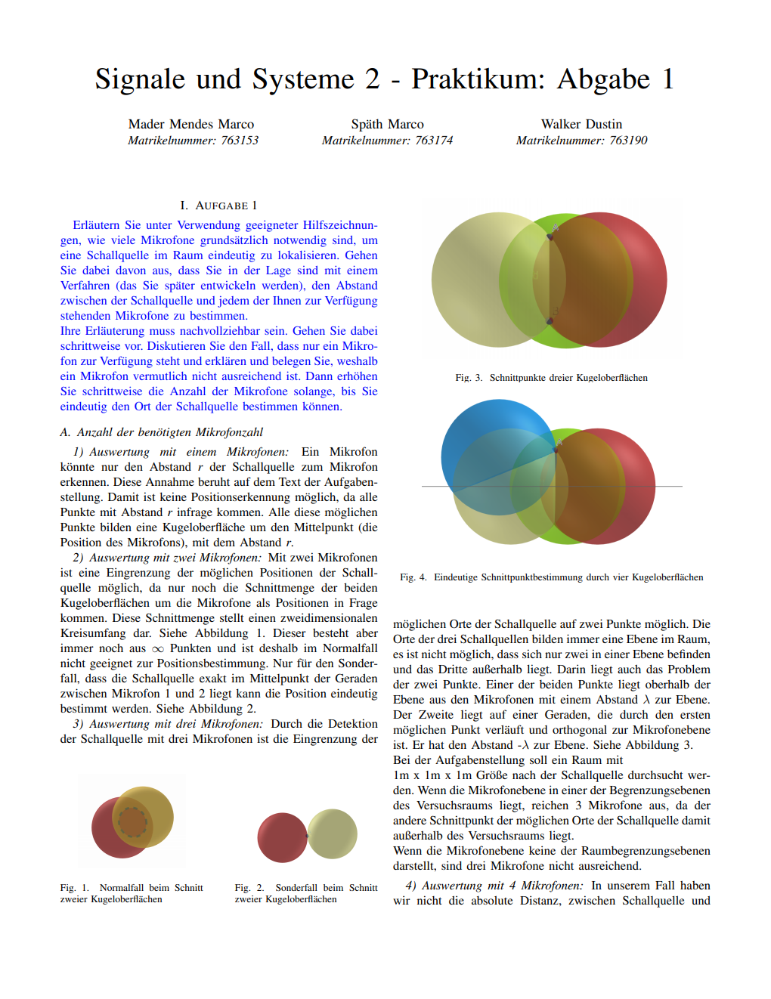

# Signale und Systeme 2 Praktikum

> ## Bestimmung der 3D-Position einer Geräuschquelle mit Mikrofonen

Der Code in diesem Repository ist im Rahmen des Signale und Systeme 2 Praktikum (Hochschule Reutlingen) entstanden.
Das Praktikum wurde in einer Gruppe aus drei Personen absolviert.

Es geht darum die Position einer Geräuschquelle mithilfe von mehreren Mikrofonen zu bestimmen.
Es werden verschiedene Untersuchungen angestellt, um diesen Prozess zu Optimieren.
Für die Untersuchungen wird eine Matlab simulation erstellt.

Bitte lesen sie die [Dokumentation](Dokumentation.pdf)

### Preview:

